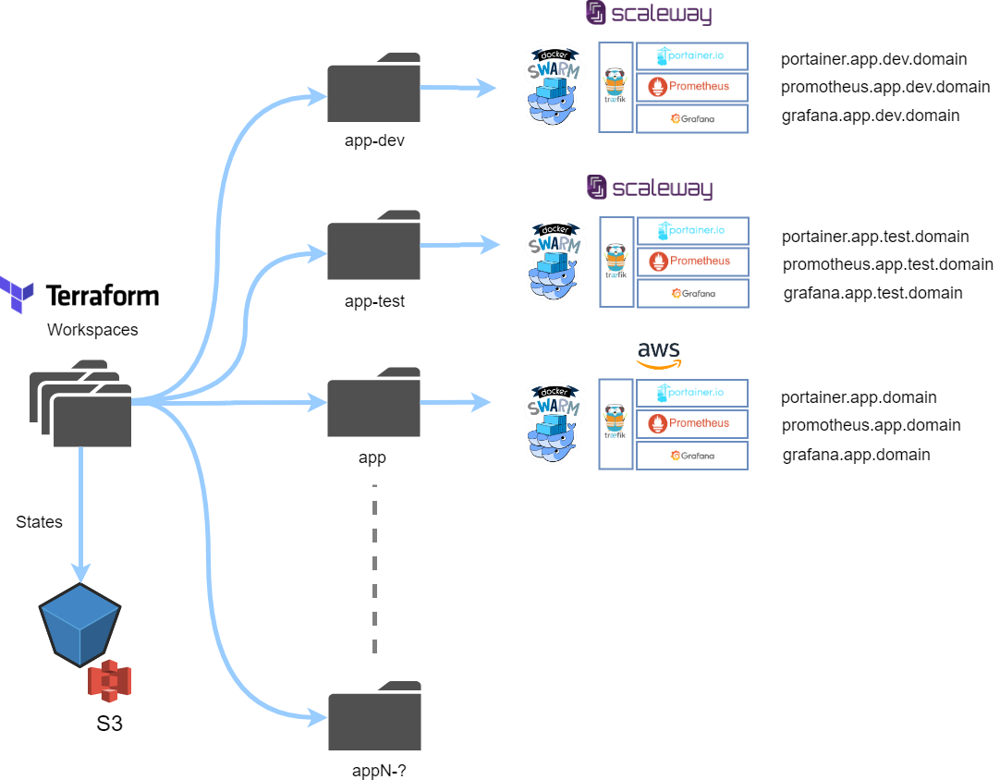
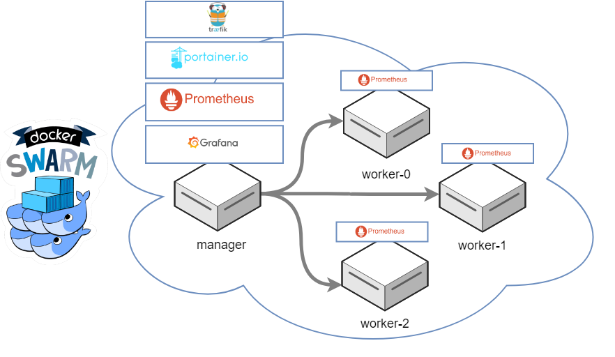

# kaabah

## What is it ?

<b>Kaabah</b> is a [Terraform](https://www.terraform.io/) based solution to create and manage a [Docker Swarm](https://docs.docker.com/engine/swarm/) infrastructure either on [Scaleway](https://www.scaleway.com/) or on [AWS](https://aws.amazon.com) bootstrapped with high level services such. This bouquet of services includes [traefik](https://traefik.io/), [portainer](https://portainer.io/), [prometheus](https://prometheus.io/) and [grafana](https://grafana.com/) in order to help you operate your cluster easily.

## How does it work ?

### Overview

The overall approach is based on the use of Terraform Workspaces. As a reminder, a Workspace  is a collection of everything Terraform needs to run: a configuration of your infrastructure (i.e. <b>kaabah</b>), values for that configuration's variables, and state data to keep track of operations. Therefore a Workplace could be considered as an instance of the the infrastructure with its own environment. Follow this [link](https://www.terraform.io/docs/enterprise/guides/recommended-practices/part1.html#the-recommended-terraform-workspace-structure) to read more about Terraform Workspaces and best practices. 

Starting from this premise, <b>Kaabah</b> allows you to manage as many clusters as your projects require and stores their states in a bucket on Amazon S3. Moreover, you have the capability to use Scaleway or AWS to host your infrastructure. Assuming, we name the our workspaces with both the project name and its environment (i.e. dev, test...), we can sketch the following diagram to illustrate the overall functioning of <b>Kaabah</b>



### Docker Swarm

<b>Kaabah</b> provides the Terraform and Docker configuration to create and manage a Docker Swarm with a stack of high level services that allows you to:
* route the traffic to the Docker Swarm: [traefik](https://traefik.io/)
* manage the services deployed on the Docker Swarm: [portainer](https://portainer.io/)
* monitor the Docker Swarm: [prometheus](https://prometheus.io/)
* analyze the Docker Swarm metrics: [grafana](https://grafana.com/)

The following diagram illustrates a Swarm cluster composed of four nodes including a <b>manager</b> and 3 <b>workers</b> and the corresponding stack of services.



## How to use it ?

### Installation

#### Clone the Github repository

```bash
$ git clone https://github.com/kalisio/kaabah.git
$ cd kaabah
```

#### Setup your Terraform environment

1. Define your Scaleway credentials

```bash
$ export TF_VAR_SCALEWAY_ACCESS_KEY="<ACCESS-KEY>"
$ export TF_VAR_SCALEWAY_TOKEN="<ACCESS-TOKEN>" 
```

2. Define your AWS credentials

```bash
$ export TF_VAR_AWS_ACCESS_KEY="<ACCESS-KEY>"
$ export TF_VAR_AWS_SECRET_KEY="<SECRET-KEY>" 
```

3. Define the [S3 backend](https://www.terraform.io/docs/backends/types/s3.html) properties 

Create a file `backend.config` with the following properties:
```
bucket = "the name of the bucket"
region = "the region of the bucket"
key    = "the key to the states"
```

4. Initialise Terraform

```bash
$ terraform init -backend-config="path/to/your/backend.config"
```

### Usage

#### Create a workspace

```bash
terraform workspace new app-dev
```

#### Configure the workspace

We recommend to create a `tfvars` file to override the default variables for your workspace. For instance, the `app-dev.tfvars` file may look like this:

```
provider = "SCALEWAY"

manager_instance_type = "C2M"

worker_instance_type = "C2S"

worker_instance_count = 2
```

#### Apply the changes

Within your workspace, apply Terraform with your specific configuration:

```
terraform apply -var-file app-dev.tfvars
```

Roughly, this will produce the following:
* reserves public IPs for each nodes (manager and workers)
* creates a security group for the instances allowing SSH, HTTP/S inbound traffic and private Docker swarm traffic.
* provision one Xenial Ubuntu instance as the docker manager with the naming convention:  `<WORKSAPCE>-manage`
* provision 2 Xenial Ubuntu instances as the docker workers with the naming convetion: `<WORKSPACE>-worker-<INDEX>`

#### Check the services

The infrastructure is powered with the following services:
* the reverse proxy [traefik](https://docs.traefik.io)
* the container manager [portainer](https://portainer.readthedocs.io) 
* the monitoring solution [prometheus](https://prometheus.io) 


