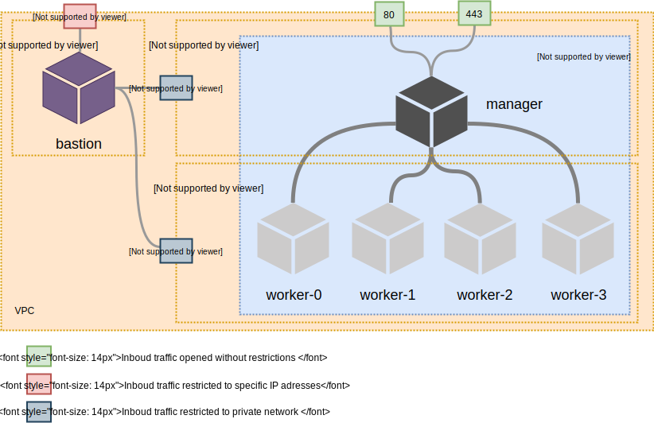

# Understanding Kaabah

::: warning Prerequisites 
**Kaabah** relies on various technologies such as [Terraform](https://www.terraform.io/), [Docker Swarm](https://docs.docker.com/engine/swarm/), [Traefik](https://traefik.io)... and we assume that you are enough familiar with them. If not, please take a while to discover them.
:::

## Key concepts

**Kaabah** let you manipulate 4 kind of entities:
* **Workspace**: a collection of everything **Kaabah** needs to create and manage an infrastructure.
* **Configuration**: a set of Terraform variables used to design your infrastructure.
* **Cluster**: a [Docker Swarm](https://docs.docker.com/engine/swarm/key-concepts/) built using **Kaabah**.
* **Service**: an application deployed on your **Cluster**. By default, **Kaabah** comes with the following services which helps operating the **Cluster**:
  * [Traefik](https://traefik.io)
  * [Prometheus](https://prometheus.io)
  * [Grafana](https://grafana.com)
  * [Registry](https://docs.docker.com/registry)
  
The following image illustrates how these entities interact:


In addition **Kaabah** provides a set of commands that help you to operate the cluster. For instance, you can easily prune all the images on the different nodes, execute a command on a given node... See the [reference](../reference/helper-commands) page to have the complete list.

## Workspace

**Kaabah** is designed to take advantage of Terraform Workspaces. Indeed, **Kaabah** relies on the [Terraform recommend practices](https://www.terraform.io/docs/enterprise/guides/recommended-practices/part1.html#the-recommended-terraform-workspace-structure) and assume a **Workspace** is used to store the required data needed to build and manage an infrastructure for a specific environment (staging, production...):
* the configuration of the infrastructure.
* the SSH private key to get connected to the infrastructure
* the extensions to the services you want to be installed by **Kaabah**
* the user scripts you want to be executed when creating the infrastructure
* the SSH private key to get connected to the infrastructure
* the Terraform states of the infrastructure.

Starting from this premise, **Kaabah** lets you to manage as many clusters as your projects require. If we decide to name our workspaces with both the project name and its environment (i.e. dev, test...), we can sketch the following diagram to illustrate the overall functioning of **Kaabah**:


In this diagram, the states of the different workspaces are stored within a dedicated bucket on amazon S3, but you are free to use any other Terraform [backends](https://www.terraform.io/docs/backends/).

## Configuration

The **Kaabah** configuration file is a **Terraform** variable file describing the characteristics of the desired infrastructure.

Here is an example of a configuration file:

```ini
provider = "AWS"

manager_ip = "3.115.176.41"

manager_instance_type = "t2.small"

worker_instance_type = "t3.large"

worker_instance_count = 3

worker_additional_volume_count = 2

worker_additional_volume_size = 500

worker_additional_volume_type = "st1"

worker_additional_volume_mount_point = "DATA"

```

Assuming the current workspace is `app-dev`, then when applying such a configuration, **Kaabah** will generate a Docker Swarm infrastructure on `AWS` (`provider` variable) composed of:
* one manager node, `app-dev-manager`, of type `t2.small` with the public IP address `3.115.176.41`.
* `3` worker nodes, `app-dev-worker-0`, `app-dev-worker-1` and `app-dev-worker-2`, of type of `t3.large`. To each worker is attached `2` optimized hard-disk (`sc1`) of `500`GB and these volumes are accessible through the mount points: `/mnt/DATA0` and `/mnt/DATA1`.

**Kaabah** exposes many more variables allowing you to customize in detail your infrastructure such as specifying a domain name, adding labels, running user scripts... Have a look at the complete list of [variables](../reference/configuration-variables.md) and the [tests](https://github.com/kalisio/kaabah/tree/master/tests) as an example.

## Cluster

The **cluster** consists in of multiple Docker hosts which run in **swarm** mode and act as manager (to manage membership and delegation) and workers (which run services). 


### Instances

When generated from a given `<WORKSPACE>`, the instances are named according the following convention:
-  `<WORKSPACE>-manager`
-  `<WORKSPACE>-woker-<INDEX>`

You can add some labels to the nodes using the `manager_labels` and `worker_labels` variables.

::: warning
**Kaabah** supports only x86 architecture.
:::

### Volumes

When needed extra disk spaces, you can attach additional volumes to the workers. These volumes are automatically attached, formatted (ext4 file system) and mounted on the workers. By default the volumes attached on a worker are accessible with the paths `/mnt/data0`, `mnt/data1` and so on. You can override the default `data` mount point by overriding the `worker_additional_volume_mount_point` variable.
  
### Network

#### Security Groups

By default, **Kaabah** creates 2 security groups:
* the manager security group allowing:
  * external HTTP traffic (port 80)
  * external HTTPS traffic (port 443)
  * internal SSH traffic (port 22)
  * internal Docker swarm traffic.
* the workers security group with the following rules:
  * internal SSH traffic (port 22)
  * internal Docker swarm traffic

#### Docker Network

The traffic between the nodes relies on a Docker network of type of **Overlay**. 

The name of the Docker network is automatically computed from the workspace name but you can override it using the `docker_network` variable.

### Security

#### SSH

**Kaabah** requires the use of a [**Bastion**](https://en.wikipedia.org/wiki/Bastion_host) to get connected to your instances.
The implemented solution relies on the following architecture:





Your bastion instance must be instantiated in the same network of your cluster. The Security Groups rules allows the SSH traffic from the bastion.

::: warning
It is a best practice to harden your bastion host because it is a critical point of network security. Hardening might include disabling 
unnecessary applications or services, restrict the inbound traffic to well-known hosts.
:::

#### Docker Engine

The Docker daemon only allows connections from clients authenticated by a certificate signed by a Certificate Authority (CA). 

When creating the cluster, **Kaabah** handles the creation of the server and client keys but it requires you to provide this CA. Check out the [Getting started section](./getting-started.md) to learn how to generate this CA.

::: tip Note
**Kaabah** relies on [OpenSSL](https://www.openssl.org/) to generate the server and client keys.
:::

## Services

As mentioned in the introduction, **Kaabah** bootstraps a cluster with a stack of high level services that allows you to:
- route the traffic to the cluster and ensure SSL termination using [Traefik](https://traefik.io/)
- monitor the cluster using [Prometheus](https://prometheus.io/)
- analyze the cluster metrics using [Grafana](https://grafana.com/)

::: tip Note
The access to the UI of the different services is protected using Basic Authentication.
:::

In addition, **Kaabah** lets you extend this stack to add the services of your choice. See the [Extending the services](./advanced-usage.md#extending-the-services) section to learn how to do it.

### [Traefik](https://traefik.io)

**traefik** allows to route the traffic from internet to the Docker Swarm infrastructure with SSL termination. It uses [Let's Encrypt](https://letsencrypt.org/) to generate and renew SSL certificates for each services.

::: warning
Du to rate limits fixed by Let's Encrypt, it is highly recommend to set the `ca_server` variable to `https://acme-staging-v02.api.letsencrypt.org/directory` when testing your infrastructure.
:::

By default, **Kaabah** specializes the **traefik** configuration with:
* 2 entrypoints: 
  * to allow HTTPS requests (port 443)
  * to redirect HTTP (port 80) request to HTTPS (port 443)
* 5 frontends to access the services: 
  - **traefik (dashboard)**
  - **Prometheus**
  - **Alertmanager**
  - **Grafana** 

The frontend rules depend on the `subdomain` and `donain` variables defined in the Terraform configuration. Considering a workspace named `app-dev`, the default subdomain will be `app.dev`and the **traefik** configuration will be as shown in the following diagram:


### [Prometheus](https://prometheus.io)

The **Prometheus** monitoring solution is shipped with the following components:
* [Alertmanager](https://prometheus.io/docs/alerting/alertmanager/) which handles the alerts.
* the scrapers components:
  * [node-exporter](https://github.com/prometheus/node_exporter) which collect the metrics of the cluster's hosts
  * [cAdvisor](https://github.com/google/cadvisor) which collect the metrics of the services deployed on the Docker swarm

::: tip
Note that **Prometheus** is also configured to scrape:
* [the Docker engine](https://docs.docker.com/config/thirdparty/prometheus/)
* [Traefik](https://docs.traefik.io/configuration/metrics/)
:::
  
### [Grafana](https://grafana.com)

**Grafana** allows you to visualize the metrics stored in the **Prometheus** databases through dedicated dashboards.

By default, **Grafana** includes the following customizations:
* UI: 
  * Login form disabled: indeed the access to **Grafana** requires to be authenticated (basic auth). This requirement is defined using Traefik frontend rule.
  * Once authenticated, the default user is granted the `EDITOR` permissions.
* Datasources: the Prometheus datasource is included by default. 
* Dashboards: 2 dashboards are provided by default:
  * Cluster overview which allow to visualize the main metrics of the cluster nodes
  * Swarm overview which allow to visualize the main metrics of the Docker swarm   
  
### [Registry](https://docs.docker.com/registry)

The **Registry** helps you build local images on your cluster and deploy them as a service.

Read the [Using the Registry](./advanced-usage.md#using-the-registry) section.

